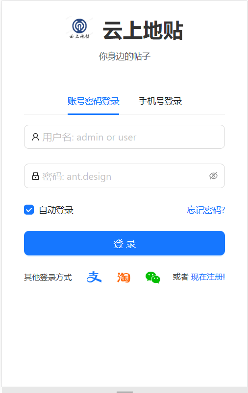
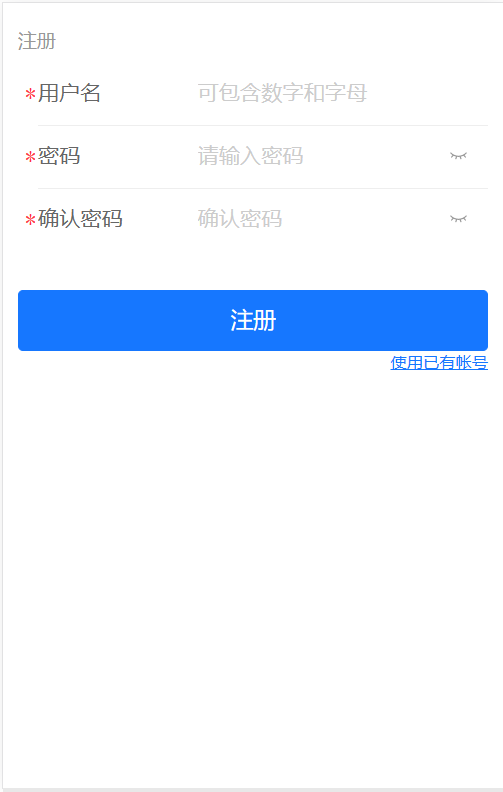
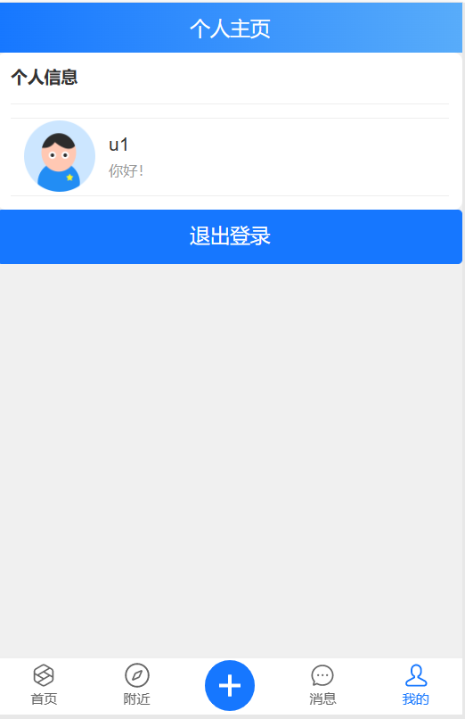
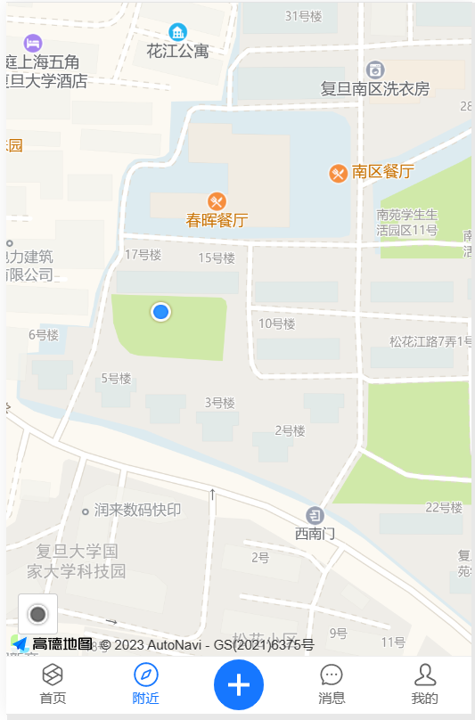

# Location-Based-Wall Front End

## 界面展示

### 登录界面



后端服务端口：Django 8000

调用后端服务路径：`POST` `api/user/login`

```javascript
give
{
	username: string // 1~9 数字或字母
	password: string // 6~9 数字或字母
}
want
{
	tag: success or fail
}
```


### 注册界面



调用后端服务路径：`POST` `api/user/register`

```javascript
give
{
	username: string // 1~9 数字或字母
	password: string // 6~9 数字或字母
}
want
{
	tag: success or fail
}
```

### 个人主页



无后端调用

### 附近的帖子


调用后端服务路径
	1. `Get` `api/user/post`
```javascript
give
{
	location_x: number 	// 当前位置经度，如上海 121.xxx
	location_y: number 	// 当前位置维度，如上海 31.xxx
	distance: number	// 与当前位置的距离
}
want 不需要详细内容，只展示位置
{
	list[] posts{
		post {
			"id": "1",
			^"title": "string",
			"location_x": 123.1,
			"location_y": 123.2
		}
	}
		
}
```

### 主页
**to be continued**
