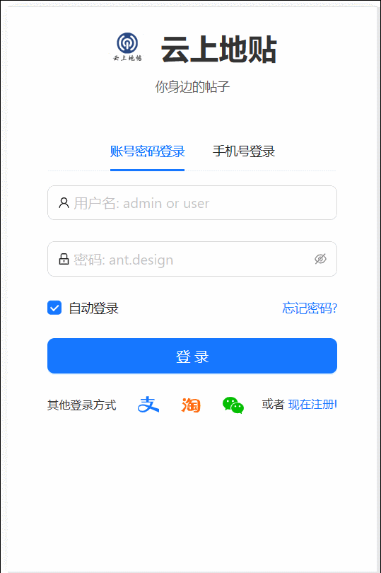
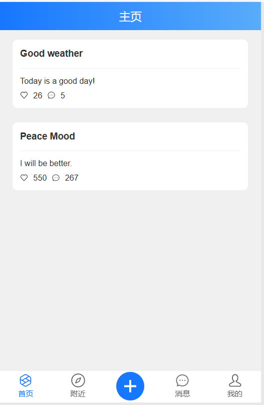

# Location-Based-Wall Front End

## 界面展示
ONLY FOR PC！！！
由于浏览器获取当前地址时要求必须访问 https 或是其他安全网站，所以本项目只在本地 PC 进行。

### 效果总览



### 登录界面


后端服务端口：Django 8000

调用后端服务路径：`POST` `api/user/login`

```javascript
give
{
	username: string // 1~13 数字或字母
	password: string // 6~9 数字或字母
}
want
{
	// tag: success or fail 
	"code": 0,
	"error_msg": "string",
	"data": {}
}
```


### 注册界面


调用后端服务路径：`POST` `api/user/register`

```javascript
give
{
	username: string // 1~13 数字或字母
	password: string // 6~9 数字或字母
}
want
{
	// tag: success or fail
	"code": 0,
	"error_msg": "string",
	"data": {
		"username": "string"
	}
}
```

### 个人主页


无后端调用

### 附近的帖子


需要当前位置附近的帖子

调用后端服务路径
	1. `Get` `api/post`

```javascript
give
{	
	// different from swagger website
	location_x: number 	// 当前位置经度，如上海 121.xxx
	location_y: number 	// 当前位置维度，如上海 31.xxx
	distance: number	// 与当前位置的距离
}
want 不需要详细内容，只展示位置
{
	list[] posts{
		post {
			"id": "1",
			"title": "string",
			"location_x": 123.1,
			"location_y": 123.2
		}
	}
		
}
```

### 主页



调用后端服务路径

`GET` `api/post`

```javascript
give
{
	location_x: number 	// 当前位置经度，如上海 121.xxx
	location_y: number 	// 当前位置维度，如上海 31.xxx
	distance: number	// 与当前位置的距离
}
want 需要详细内容，只展示位置
{
	list[] posts{
		post {
			"id": "1",
			"title": "string",
            ^"content": "string",
            ^"likes": "string",
            ^"comment_number": 1,
			"location_x": 123.1,
			"location_y": 123.2
		}
	}
		
}
```

考虑到 `api` 无法区分，可以统一格式为简略格式，无多余功能

```javascript
want 不需要详细内容，只展示位置
{
	list[] posts{
		post {
			"id": "1",
			"title": "string",
			"location_x": 123.1,
			"location_y": 123.2
		}
	}
		
}
```

### 帖子详情页

### 创建帖子以及评论

**to be continued**
