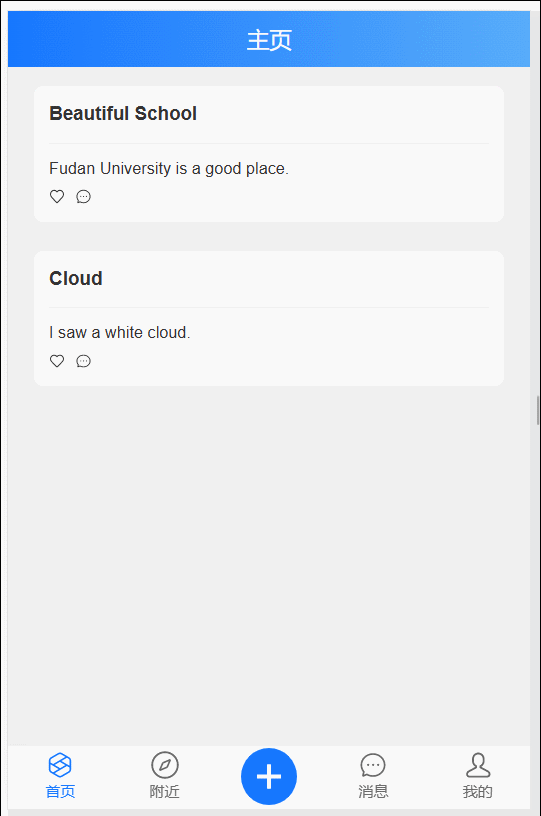
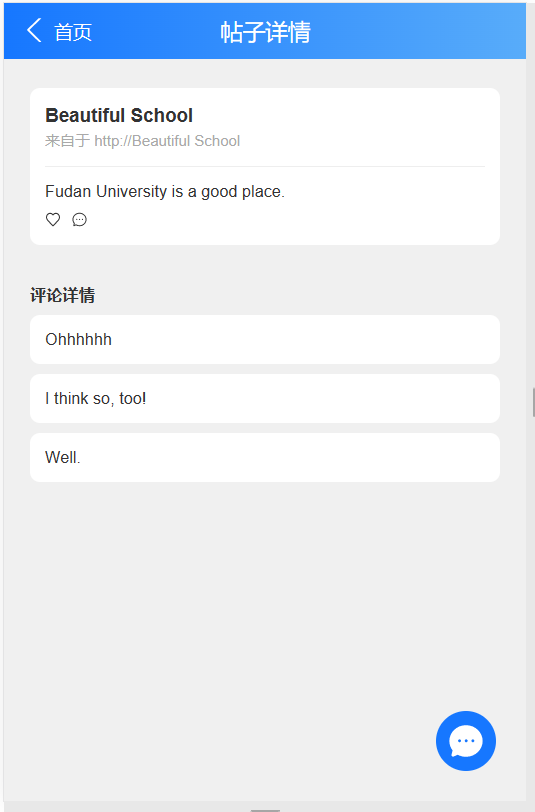
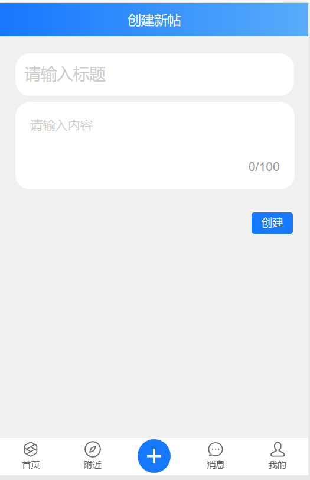
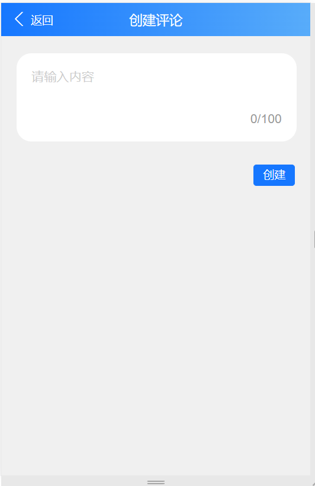

# Location-Based-Wall Front End

## 界面展示
ONLY FOR PC！！！
由于浏览器获取当前地址时要求必须访问 https 或是其他安全网站，所以本项目只在本地 PC 进行。

### 效果总览



### 登录界面


后端服务端口：Django 8000

调用后端服务路径：`POST` `api/user/login`

```javascript
give
{
	username: string // 1~13 数字或字母
	password: string // 6~9 数字或字母
}
want
{
	// tag: success or fail 
	"code": 0,
}
```


### 注册界面


调用后端服务路径：`POST` `api/user/register`

```javascript
give
{
	username: string // 1~13 数字或字母
	password: string // 6~9 数字或字母
}
want
{
	// tag: success or fail
	"code": 0,
}
```

### 个人主页


无后端调用

### 附近的帖子


需要当前位置附近的帖子

调用后端服务路径
	1. `Get` `api/post`

```javascript
give
{	
	// different from swagger website
	location_x: number 	// 当前位置经度，如上海 121.xxx
	location_y: number 	// 当前位置维度，如上海 31.xxx
	distance: number	// 与当前位置的距离
}
want 不需要详细内容，只展示位置
{
	list[] results{
		{
			"id": "1",
			'title': post.title,
			'content_type': post.content_type,
			'text': post.text,
			'media_url': post.media_url,
			'location_x': post.location_x,
			'location_y': post.location_y
		}
	}
		
}
```

### 主页


调用后端服务路径

`GET` `api/post`

需要标题内容和位置

```javascript
give
{
	location_x: number 	// 当前位置经度，如上海 121.xxx
	location_y: number 	// 当前位置维度，如上海 31.xxx
	distance: number	// 与当前位置的距离
}
want
{
	list[] results{
		{
			"id": "1",
			'title': post.title,
			'content_type': post.content_type,
			'text': post.text,
			'media_url': post.media_url,
			'location_x': post.location_x,
			'location_y': post.location_y
		}
	}
		
}

```

### 帖子详情页


调用后端服务路径

`GET` `api/post/${postid}`

`GET` `api/comment/${postid}`

### 创建帖子以及评论


调用后端服务路径

`POST` `api/post/`



`POST` `api/comment/${postid}`
**to be continued**
